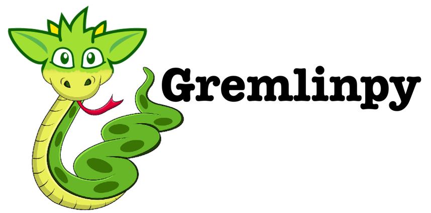

> Note: 3.6.0 changes the way arguments are automatically bound in Function objects. The old way was to only bind the last argument in a function call, but with 3.6.0 all arguments will be bound. This may break some tests that check the contents of the generated scripts. Please update accordingly

Gremlinpy
=========

Gremlinpy is a small library that allows you to write pure Python and output GremlinGroovy script complete with bound parameters that can be run against a Tinkerpop 3 Gremlin server instance. It is meant to be a low-level way for your application to communicate its intent with the graph server. The best way to think of Gremlinpy is as a very flexible query builder that doesn't limit what can be expressed with Python for GremlinGroovy.



## Setup

    python setup.py install

or

    pip install gremlinpy

or

    easy_install gemlinpy

## Overview

Python's syntax nearly mirrors Groovy's one-to-one so Grelinpy allows for an easy to manipulate Python object that will produce a Gremlin string as a result.

Gremlinpy works by tokenizing every action taken on the `gremlinpy.gremlin.Gremlin` instance into a simple linked list. Each `Gremlin` instance starts with a `GraphVariable` and chains the rest of the tokens to it.

If you wanted to produce a Gremlin script like this:

    g.v(12).outE('knows').inV

You would simply write:

```python
    g = Gremlin()
    g.v(12).outE('knows').inV
```

Once that is converted to a string, your gremlin instance will hold the bound params (you have the ability to control the names of the bindings).

```python
    script = str(g) #g.v(GP_KKEI_1).outE(GP_KKEI_2).inV
    params = g.bound_params #{'GP_KKEI_1': 12, 'GP_KKEI_2': 'knows'}
```

It's that simple, but Gremlinpy allows you to write very complex Gremlin syntax in pure Python. And if you're having trouble expressing the Gremlin/Groovy in the Python model, it allows for straight string manipulation complete with parameter binding.

Though the usage of Python's magic methods, we can compose a Gremlin string by recording every attribute, item, or call against the instance and creating a token for it. There are multiple token types that allow you to express Gremlin with Python: 

__GraphVariable__: This is the root token in the list. It is always present and will be used in every Gremlin string produced. It can be nullified by calling `Gremlin.set_graph_variable('')` or during instantiation `g = Gremlin('')`. That is useful for when you are running scripts that may not interact with the graph or when your graph variable is something other than the letter "g".

__Attribute__: Attributes are things on the Gremlin chain that are not functions, arent closures, and are not indexes. They stand alone and are defined when you call any sequence without parenthesis on your Gremlinpy instance. 

```python
    g.a.b #g.a.b -- a and b are the attribues
```

__Function__: Functions are called when you add parenthesis after an attribute. The function object will bind every argument passed into it.

```python
    g.V(12) #g.v(GP_UUID_1)
    g.bound_params # {'GP_UUID_1': 12}
    
    g.v.has('name', 'mark') #g.v.has(GP_CXZ_1, GP_CXZ_2)
    g.bound_params # {'GP_CXG_2': 'mark', 'GP_CXZ_1': 'name'}
```

A function can also be added to the chain by calling the `func` method on the `Gremlin` instance. The first argument is the name of the function, the rest are bound arguments in the final resulting string. This is useful for function names that are reserved words in Python.

```python
    g.V(12).func('myMagicFunction', 'arg') # g.V(GP_III_1).myMagicFunction(GP_III_2)
    g.bound_params # {'GP_III_1': 12, 'GP_III_2': 'arg'}
```

__FunctionRaw__: Works as `Function` but does not prepend the dot before the function name.

```python
    g.set_graph_variable('')
    g.function('arg')func_raw('some_function', 'raw content')
    # function(GP_IUNX_1)some_function(raw content)
```

__UnboundFunction__: This allows you to call a function, but not have the instance automatically bind any of the params. It has a different syntax than just chaning a function in the previous exmaple:

```python
    g.unbound('function', 'arg', 1, 3, 5) #g.function(arg, 1, 3, 5)
```

__UnboundFunctionRaw__: This works like `UnboundFunction` except it does not prepend a dot before the function definition. 

```python
    g.set_graph_variable('')
    g.func_raw_unbound('if', '1 == 2').close('1 is 2?').func_raw_unbound('elseif', '2 == 2').close('2 is 2')
    # if(1 == 2){1 is 2?}elseif(2 == 2){2 is 2}
```

__Closure__: Closures simply allow you to put things between curly braces. Since it is an error to add curly braces to the end of Python objects, this has its own method on the `Gremlin` instance:

```python
    g.func.close('im closing this') # g.func{im closing this}
```

__ClosureArguments__: Groovy allows for inline lambda functions in a syntax that isn't supported by Python. To define the signature for the closure you simply pass in args after the first argument on a closure:

```python
    g.func.close('body', 'x', 'y') # g.func{x, y -> body }
```

__Raw__: Raw allows you to put anything in and have it passed out the same way. It doesn't put anything before or after the call. It is useful for when you're doing something that cannot easily map:

```python
    g.set_graph_variable('')
        .raw('if(').raw('1 == 2').raw(')')
        .close("'never'")
        .else.close("'always'")
    # if(1 == 2){'never'}else{'always'}
```

> note: this is just an example, there are better ways to do complex composition


### Predicates

GremlinGroovy has an idea called [predicates](http://tinkerpop.apache.org/docs/3.0.0-incubating/#a-note-on-predicates). A predicate can simply be seen as a traversal that starts with a function and not a graph variable.

Gremlinpy supports all of the GremlinGroovy defined predicates by sub-classing a `Predicate` object.

* eq
* neq
* lt
* lte
* gt
* gte
* inside
* outside
* between
* within
* without

Gremlinpy also aliases some of the predicates that are reserved words in Python:

* NOT -- not
* IS -- is
* AS -- as
* IN -- in
* FROM -- from
* TO -- to
* OR -- or

Predicates are used just like any other Gremlin instance:

```python
    from gremlinpy import Gremlin

    g = Gremlin()
    g.V().has('name', neq('mark')) # g.V().has(GP_OOP_1, neq(GP_OOP_2))
    g.bound_params # {'GP_OOP_1': 'name', 'GP_OOP_2': 'mark'}
```

Gremlinpy allows you to create a predicate on the fly using the `_` function:

```python
    from gremlinpy import Gremlin, _

    g = Gremlin()
    g.V().has(_('myPredicate', [1, 2])) # g.V().has(myPredicate(GP_UIY_1, GP_IUY_2))
    g.bound_params # {'GP_UIY_1': 1, 'GP_UIY_2': 2}
```


### Overloading

The `Gremlin` instance has members that are basically reserved words and will not be passed to your resulting gremlin script. 

These include:

* \__init__
* reset
* \__getitem__
* set_graph_variable
* any other mehtod or property on the object

If you need the resulting gremlin script to print out '\__init__' or one of the reserved words, you can simply call `add_token` on your instance:

```python
    init = Function(g, '__init__', ['arg'])
    g.add_token(init) # g.__init__(GP_XXX_1)
    
    init = Attribute(g, '__init__')
    g.add_token(init).xxx() # g.__init__.xxx()
    
    add_token = UnboudFunction(g, 'add_token', [5, 6])
    g.add_token(add_token) # g.add_token(5, 6)
```

### Binding Params

All parameters passed into a function are automatically bound. Each `Gremlin` instance creates a unique key to hold the bound parameter values to. However, you can manually bind the param and pass a name that you desire.

```python
    bound = g.bind_param('my_value', 'MY_PARAM')
    
    g.v(bound[0]) # g.v(MY_PARAM)
    g.bound_params # {'MY_PARAM': 'my_value'}
```

Gremlinpy will attempt to reuse binding names in the generated script. If you previously bound 'mark is great' and bind it again, the script will utilize the same parameters for each instance. This will save on the overall payload that is sent to the Gremlin server and it will save on what the Gremlin server has to cache.

~~~python

    bound = g.bind_param('some value', 'SOME\_KEY')
    g.function(bound[0]).func2(bound[0]) # g.function(SOME\_KEY).func2(SOME_KEY)
~~~

The easiest way to bind params is to use the `Param` object and pass it where needed:

```python
    g = Gremlin()
    name_param = Param('name', 'mark')
    g.V().has('name', name_param) ...
```

### Nesting Instances

Gremlinpy gets interesting when you want to compose a very complex string. It will allow you to nest `Gremlin` instances passing any bound params up to the root instance. 

Nesting allows you to have more control over query creation, it offers some sanity when dealing with huge strings.

```python
    g = Gremlin()
    i = Gremlin()
    
    i.set_graph_variable('').it.setProperty('age', 33)
    g.v(12).close(i) # g.v(GP_XXQ_1){it.setProperty(GP_UYI_3, GP_UYI_1)}
    
    g.bound_params # {'GP_XXQ_1': 12, 'GP_UYI': 33, 'GP_UYI_3': 'age'}
```

### Copying

Gremlinpy has a built-in way to copy instances. This is useful for when you want to branch at a current point along the path, but keep the preceding definitions in tact.

```python
page = get_page()
per_page = get_per_page()

g = Gremlin().hasLabel('user').hasId(15).out('blog_post') # get all of the blog posts for user 15

# we will branch here to get the total number of posts for the user
total = g.copy().size()

# we continue here to paginate
g.range(page, page * per_page)

# run queries
```

## Statements

Gremlinpy allows you to compose very complex gremlin chains. A Gremlinpy Statement object allows you to encapsulate and package a part of that construction.

Gremlinpy works by tokenizing every action against the object instance into a simple linked list, a statement will allow you apply a preset token definiton to a `Gremlin` instance.

### Usage

Statements can be used in a few ways, the simplest is to apply it directly to a Gremlin instance. When used this way the statement will augment the Gremlin instance that is directly applied to.

```python
    class HasMark(Statement):
        """
        this statement simply appends .has('name', 'Mark') to a gremlin script
        """
        def build(self):
            g = self.gremlin()
            
            g.has('name', 'Mark')
    
    g = Gremlin()
    mark = HasMark()
    g.V.apply_statement(mark)
    
    str(g) # g.V.has(GP_IOKH_1, GP_IOKH_2)
    g.bound_params # {'CP_IOKH_1': 'name', 'GP_IOKH_2': 'Mark'}
```

Statements can also be chained:

```python
    class HasSex(Statement):
        def __init__(self, sex):
            self.sex = sex

        def build(self):
            self.gremlin.has('sex', self.sex)

    g = Gremlin()
    mark = HasMark()
    sex = HasSex('male')

    g.V.apply_statement(mark).apply_statement(sex)
    
    str(g) # g.V.has(GP_IOKH_1, GP_IOKH_2).has(GP_IOKH_3, GP_IOKH_4)
    g.bound_params # {'CP_IOKH_1': 'name', 'GP_IOKH_2': 'Mark', 'GP_IOKH_3': 'sex', 'GP_IOKH_4':  'male'}
```

A statement can be passed into a Gremlin instance Function, Raw, Closure call. These statements will not modify the Gremlin instance that they are passed into. If you want the statement to have a specialized Gremlin instance, you must pass it into the statement. Otherwise a blank Gremlin instance is created and passed into the Statement.

> Note: do not pass in the outer Gremlin instance to Statements that will be used this way as an infinite loop will be created

```python
    class GetV(Statement):
        def __init__(self, id):
            self.id = id
        
        def build(self):
            self.gremlin.v(self.id)
            
    g = Gremlin()
    v = GetV(44)
    if_con = UnboundFunction(g, 'if', '1 == 1')
    
    g.set_graph_variable('').add_token(if_con).close(v)
    
    str(g) # if(1 == 1){g.v(GP_DDIO_1)}
    g.bound_params # {'GP_DDIO_1': 44}
```

## Performance Tweaks
### Always Manually Bind Params

If your Gremlin server instance has query caching turned on, manually binding params will allow you to create statements on the server that will  pre-parse your query the second time you run it an return results quicker.

If you are not manually binding params, every time you call a script, even the same script, a different one is being sent to the server.

```python
    g.v(12) # g.v(GP_XSX_1)
   
    #later 
    g.v(12) # g.v(GP_POI_1)
```

If you manually bind the param with a name, the same script will be sent to the server and it will drastically cut down on execution times. This is true even if the param values are changed:

```python
    id = g.bind_param(12, 'eyed')
    g.v('eyed') #g.v(eye_d)
    
    id = g.bind_param(9999, 'eyed')
    g.v('eyed') #g.v(eye_d)  <--- this one executes faster than the first
```
